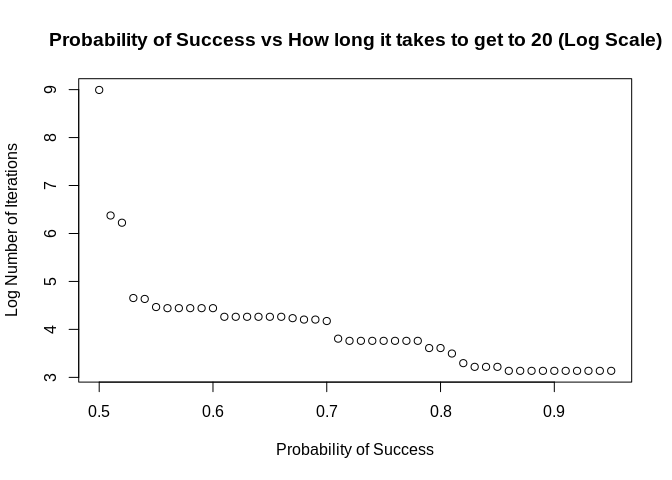

<!-- README.md is generated from README.Rmd. Please edit that file -->

# peruse

<!-- badges: start -->
<!-- badges: end -->

The {peruse} package is aimed at making it easier to generate irregular
sequences that are difficult to generate with existing tools.

The heart of {peruse} is the `S3` class `Iterator`. An `Iterator` allows
the user to write an arbitrary R expression that returns the next
element of a sequence of R objects. It then saves the state of the
`Iterator`, meaning the next time evaluation is invoked, the initial
state will be the result of the previous iteration. This is most useful
for generating recursive sequences, those where each iteration depends
on previous ones.

The package also provides a simple, tidy API for set building, allowing
the user to generate a set consisting of the elements of a vector that
meet specific criteria. This can either return a vector consisting of
all the chosen elements or it can return an `Iterator` that lazily
generates the chosen elements.

## Installation

You can install the released version of peruse from
[CRAN](https://CRAN.R-project.org) with:

``` r
install.packages("peruse")
```

And the development version from [GitHub](https://github.com/) with:

``` r
# install.packages("devtools")
devtools::install_github("jacgoldsm/peruse")
```

## Example

### Negative Binomial Investigation

Suppose we want to investigate the question of how many trials it takes
for a random walk with drift to reach a given threshold. We know that
this would follow a Negative Binomial distribution, but how could we use
the Iterator to look at this empirically in a way that easily allows us
to adjust the drift term and see how the result changes? We might do
something like this:

``` r
p_success <- 0.5
threshold <- 100


iter <- Iterator({
          set.seed(seeds[.iter])
          n <- n + sample(c(1,-1), 1, prob = c(p_success, 1 - p_success))
        },
        list(n = 0, seeds = 1000:1e5), 
        n)
sequence <- yield_while(iter, n <= threshold)

plot(sequence, main = "How many iterations does it take to get to 100?")
```


How would we apply this same function to a grid of probabilities? We
could do something like this:

``` r
probs <- seq(0.5,0.95, by = 0.01)
exprs <- rep(NA, length(probs))
num_iter <- rep(NA, length(probs))
threshold <- 20
seeds <- 1000:1e6


for (i in seq_along(probs)) {
  iter <- Iterator({
           set.seed(seeds[.iter])
           n <- n + sample(c(1,-1), 1, prob = c(!!probs[i], 1 - !!probs[i]))
          }, 
          list(n = 0),
          yield = n)
  
  num_iter[i] <- length(yield_while(iter, n <= threshold))
}

plot(x = probs,
     y = log(num_iter),
     main = "Probability of Success vs How long it takes to get to 20 (Log Scale)",
     xlab = "Probability of Success",
     ylab = "Log Number of Iterations")
```



This illustrates a few useful features of Iterators:

-   We can use environment variables in either our expression or our
    `while` condition to represent constants. In this case, `threshold`
    doesn’t change between iterations or between parameters. If you are
    creating many `Iterator`s, it can be faster to use environment
    variables, since you don’t have to make a new object for each new
    `Iterator`.

-   We can use the forcing operators from {rlang} (!!) to force
    evaluation of arguments in place, in this case substituting the
    *expression* of `probs[i]` with the *value* of `probs[i]`.

-   We can refer to the current iteration number in `yield_while()`,
    `yield_more()`, or their silent variants with the variable `.iter`.

### Collatz Sequence

A Collatz sequence is a particular sequence of natural numbers that
mathematicians think always reaches 1 at some point, no matter the
starting point. We can’t prove that one way or the other, but we can
create an `Iterator` that lazily generates a Collatz sequence until it
reaches 1:

``` r
library(peruse)
  
# Collatz generator starting at 50
collatz <- Iterator({
             if (n %% 2 == 0) n <- n / 2 else n <- n*3 + 1
           },
           initial = list(n = 50),
           yield = n)

yield_while(collatz, n != 1L)
#>  [1] 25 76 38 19 58 29 88 44 22 11 34 17 52 26 13 40 20 10  5 16  8  4  2  1
```

### Random Walk with Drift

Random Walks, with or without drift, are one of the most commonly used
type of stochastic processes. How can we simulate one with {peruse}?

``` r
rwd <- Iterator({
         n <- n + sample(c(-1L, 1L), size = 1L, prob = c(0.25, 0.75))
       },
       initial = list(n = 0),
       yield = n)


Value <- yield_while(rwd, n != 50L & n != -50L)

plot(Value, main = "The Value of the Iterator after a Given Number of Iterations")
```


Here, we can see that `seq` gets to `50` after about `100` iterations
when it is weighted `3:1` odds in favor of adding `1` over adding `-1`
to the prior value.

### Primes

How about generating all the prime numbers between `1` and `100`? We can
easily do that with the set-builder API:

``` r
2:100 %>% 
  that_for_all(range(2, .x)) %>% 
  we_have(~.x %% .y != 0)
#>  [1]  2  3  5  7 11 13 17 19 23 29 31 37 41 43 47 53 59 61 67 71 73 79 83 89 97
```

In the equation, we can reference the left-hand side of the equation
with the positional variable `.x`, and the right-hand side (that is, the
argument in `that_for_all()`) with `.y`. The equation can be anything
recognized as a function by `purrr::as_mapper()`.

But how about if we want to generate the first 100 prime numbers? We
don’t know the range of values this should fall in (well, mathematicians
do), so we can use laziness to our advantage:

``` r
primes <- 2:10000 %>%
            that_for_all(range(2, .x)) %>% 
            we_have(~.x %% .y, "Iterator")

primes_2 <- clone(primes)
```

The first prime number is

``` r
yield_next(primes_2)
#> [1] 2
```

And the first 100 are:

``` r
sequence <- yield_more(primes, 100)
sequence
#>   [1]   2   3   5   7  11  13  17  19  23  29  31  37  41  43  47  53  59  61
#>  [19]  67  71  73  79  83  89  97 101 103 107 109 113 127 131 137 139 149 151
#>  [37] 157 163 167 173 179 181 191 193 197 199 211 223 227 229 233 239 241 251
#>  [55] 257 263 269 271 277 281 283 293 307 311 313 317 331 337 347 349 353 359
#>  [73] 367 373 379 383 389 397 401 409 419 421 431 433 439 443 449 457 461 463
#>  [91] 467 479 487 491 499 503 509 521 523 541
```

Here, we use `clone()` to create an identical `Iterator` to `primes`
that can be modified separately.
