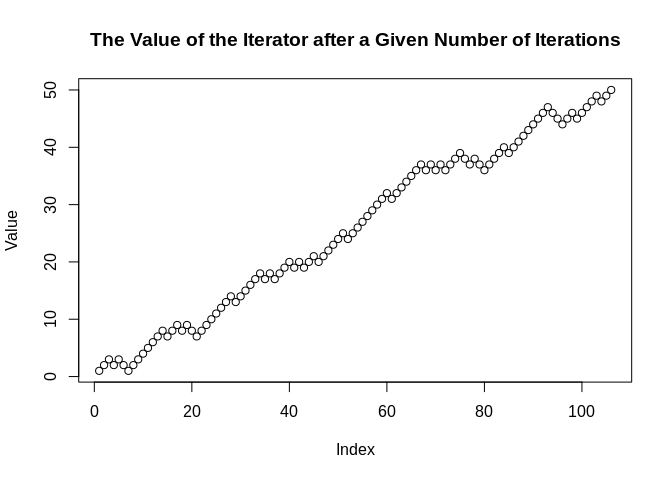

<!-- README.md is generated from README.Rmd. Please edit that file -->

# peruse

<!-- badges: start -->

<!-- badges: end -->

The {peruse} package is aimed at making it easier to generate irregular
sequences that are difficult to generate with existing tools. The heart
of {peruse} is the `S3` class `Iterator`. An `Iterator` allows the user
to write an arbitrary R expression that returns the next element of a
sequence of R objects. It then saves the state of the `Iterator`,
meaning the next time `yield_next` is called, the subsequent element of
the sequence will be returned.

The package also provides a simple, tidy API for set building, allowing
the user to generate a set consisting of the elements of a vector that
meet specific criteria. This can either return a vector consisting of
all the chosen elements or it can return an `Iterator` that lazily
generates the chosen elements.

Finally, {peruse} also provides a new data structure stores a
`data.frame` as an object with reference semantics and `O(1)` access to
columns. This is useful when iterating over `data.frame`s with many
columns, because the object is modified in place, rather than making a
shallow copy on every iteration.

## Installation

You can install the released version of peruse from
[CRAN](https://CRAN.R-project.org) with:

``` r
install.packages("peruse")
```

And the development version from [GitHub](https://github.com/) with:

``` r
# install.packages("devtools")
devtools::install_github("jacgoldsm/peruse")
```

## Example

### Collatz Sequence

A Collatz sequence is a particular sequence of natural numbers that
mathematicians think always reaches `1` at some point, no matter the
starting point. We can’t prove that one way or the other, but we can
create an `Iterator` that lazily generates a Collatz sequence until it
reaches `1`:

``` r
library(peruse)
#> Loading required package: magrittr
#> 
#> Attaching package: 'peruse'
#> The following object is masked from 'package:base':
#> 
#>     range
expr <- "if (n %% 2 == 0) n <- n / 2 else n <- n*3 + 1"
  
# Collatz generator starting at 50
collatz <- Iterator(result = expr,
                    initial = c(n = 50),
                    yield = n)

i <- 0
while (i != 1L) {
  i <- yield_next(collatz)
  cat(paste0(i, "\n"))
}
#> 25
#> 76
#> 38
#> 19
#> 58
#> 29
#> 88
#> 44
#> 22
#> 11
#> 34
#> 17
#> 52
#> 26
#> 13
#> 40
#> 20
#> 10
#> 5
#> 16
#> 8
#> 4
#> 2
#> 1
```

### Random Walk with Drift

Random Walks, with or without drift, are one of the most commonly used
type of stochastic processes. How can we simulate one with ?

``` r
set.seed(1)
expr <- 'n <- n + sample(c(-1L, 1L), size = 1L, prob = c(0.25, 0.75))'
rwd <- Iterator(result = expr,
                initial = c(n = 0),
                yield = n)


Value <- integer()
reach <- 0L
while (reach != 50L & reach != -50L) {
  reach <- yield_next(rwd)
  Value <- c(Value, reach)
}

plot(Value, main = "The Value of the Iterator after a Given Number of Iterations")
```



Here, we can see that `seq` gets to `50` after about `100` iterations
when it is weighted `3:1` odds in favor of adding `1` over adding `-1`
to the prior value.

### Primes

How about generating all the prime numbers between `1` and `100`? We can
easily do that with the set-builder API:

``` r
cat(2:100 %>% that_for_all(range(2, .x)) %>% we_have(~.x %% .y != 0))
#> 2 3 5 7 11 13 17 19 23 29 31 37 41 43 47 53 59 61 67 71 73 79 83 89 97
```

But how about if we want to generate the first \(100\) prime numbers? We
don’t know the range of values this should fall in (well, mathematicians
do), so we can use laziness to our advantage:

``` r
primes <- 2:10000 %>%
            that_for_all(range(2, .x)) %>% 
            we_have(~.x %% .y != 0, "Iterator")

sequence <- c()
while (length(sequence) <= 100) {
  sequence <- c(sequence, yield_next(primes))
}

cat(sequence)
#> 2 3 5 7 11 13 17 19 23 29 31 37 41 43 47 53 59 61 67 71 73 79 83 89 97 101 103 107 109 113 127 131 137 139 149 151 157 163 167 173 179 181 191 193 197 199 211 223 227 229 233 239 241 251 257 263 269 271 277 281 283 293 307 311 313 317 331 337 347 349 353 359 367 373 379 383 389 397 401 409 419 421 431 433 439 443 449 457 461 463 467 479 487 491 499 503 509 521 523 541 547
```

### hash\_df

When dealing with text data, it is common to run models on a very wide
data set, with thousands of variables representing each token. Doing
transformations on a wide data set can be very expensive, as every time
a column is transformed, a shallow copy is made of the `data.frame`.

Here is an example of a wide data set representing the reviews of a
great variety of wines. Each column represents a token, and the values
represent the raw count of the number of times the word appears in a
given review.

    #> Dimensions: 20000 by 15578
    #> # A tibble: 5 x 5
    #>   ident word_100 word_2022 word_2030 word_a
    #>   <chr>    <int>     <int>     <int>  <int>
    #> 1 1            1         1         1      2
    #> 2 10           0         0         0      1
    #> 3 100          0         0         0      2
    #> 4 1000         0         0         0      2
    #> 5 10000        0         0         0      2

What if we want to normalize all these columns by the absolute frequency
of the word in the data set? Normally, it would take a very long time to
iterate over all \(15,578\) columns. However, it is very fast with a
`hash_df`:

``` r
hash_frequencies <- hash_df$new(wide_descriptions)

transform <- function(x) {
  if (is.numeric(x)) x / sum(x) else x
}
hash_frequencies$data <- lapply(hash_frequencies$data,
                            transform)

(hash_frequencies$return_df())[1:5, 1:5]
#>   word_frail word_pineapples word_clarion word_joey word_pineappley
#> 1          0               0            0         0               0
#> 2          0               0            0         0               0
#> 3          0               0            0         0               0
#> 4          0               0            0         0               0
#> 5          0               0            0         0               0
```

(Note that the column order gets scrambled, as environments have no
element order).

Even easier, we can use implementations of `dplyr`-esque `mutate_*`
functions on the objects:

``` r
hash_frequencies <- hash_df$new(wide_descriptions)

hash_frequencies$mutate_if(is.numeric, ~.x / sum(.x))
```

Any such task is quick and easy with the `hash_df`\!

## Functions

### Iterators:

  - as\_Iterator()
  - is\_Iterator()
  - Iterator()
  - yield\_next()

### Sets

  - that\_for\_all()
  - that\_for\_any()
  - we\_have()

### hash\_df

  - $bind()
  - $unbind()
  - $return\_df()
  - $print()
  - $new()
  - $View()
  - $mutate()
  - $mutate\_if()
  - $mutate\_all()
  - $select()
  - $select\_if()
  - $select\_at()
  - $clone()
